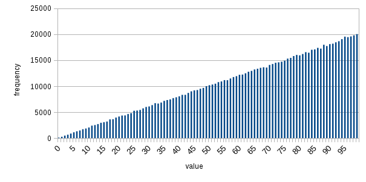

# Data Generator Tool

In the age of big data analysis and other buzzwords one of the hottest things is an estimation of production environment. One of the biggest issues that can be faced on a performance stage is an absence of real source data. Not only financial organization, but many others are not willing to provide even obfuscated production data to be used outside the establishment. So the proper modeling of production data is an important part of development workflow.

NO provides a stream based DG framework which having a flexible configuration for any unconditioned data structures can produce more than half a billion characters per second. When the base extension provides an implementation to cover the vast majority of cases the modular SPI based architecture allows to easily integrate any specific additional module.

## Architecture

There are two functional phases to the architecture:

1. Configuration;
2. Streaming;

### Configuration


The `main` appender is being configured via YAML configuration file. See a simple SQL example below:

```yaml
main:
  type: join
  delimiter: "\n"
  number: 1000000
  sample:
    type: template
    template: insert into `User` (id, uid, fn, ln, age) values ({0}, "{1}", "{2}", "{3}", "{4}");
    samples:
      - type: seqInt
      - type: rndStr
      - fn
      - ln
      - age
generators:
  - id: fn
    type: rndSet
    samples:[ Alexander, Andreas, Benjamin, John ]
  - id: ln
    type: rndSet
    samples: [ Smith, Johnson, Williams, Jones, Brown ]
  - id: age
    type: rndInt
    shift: 21
    count: 20
sources:
```

The generators or random data source can be described inline or via references. Additional root section `generators` and `sources` are provided.

#### Generator Structure:
Pproperty | Description | Mandatory
--- | --- | ---
`id` | the identifier of the generator to use as a reference in the composition
`parent` | a parent configuration reference to inherit properties from another generator
`type` | the type of a generator to specify the generator implementation. See the [full](doc/generators.md) list of supported types | if parent is not specified
... | a type specific set of generator properties

#### Source Structure:
Pproperty | Description | Mandatory
--- | --- | ---
`id` | the identifier of the number data source to use as a reference in the other generators
`parent` | a parent configuration reference to inherit properties from another source
`type` | the type of a source to specify the source implementation. See the [full](doc/sources.md) list of supported types. | if parent is not specified
`distribution` | the list of weights of frequency deviation from uniformly distribution. See distribution example below.
`di` | the distribution interpolation type. The following values are possible: ln - linear, sp - spline, dd - tbd, nv - tbd,  ha - tbd, ls - tbd.
... | a type specific set of source properties

The linear spline is used to interpolate the distribution. See an example:

Result | `di` | `distribution`
--- | --- | ---
 | ln | [ 0.0, 1.0 ]
 | sp | [ 0.0, 1.0, 0.0 ]

### Streaming


The tool can be run as part of existing application or as a command line tool. See dev examples below.

#### SQL
```
java -jar generator-cli/target/generator.jar -c generator-cli/configuration.yaml -o /dev/stdout
```
That produces a sql based random data:
```
...
insert into `User` (id, uid, fn, ln, age) values (84208, "QU2aZWglTOsxdKOF", "John", "Jones", "48");
insert into `User` (id, uid, fn, ln, age) values (84209, "deHeKX60ZlzeQAQy", "John", "Brown", "49");
...
```

#### Elasticsearch

Configuration:
```yaml
main:
  type: join
  number: 5000000
  sample:
    type: template
    template: |+
      { "create":  { "_index": "beans", "_type": "bean", "_id": "{0}" }}
      { "fn" : "{1}", "ln" : "{2}", "age" : {3} }
    samples:
      - type: seqInt
        next: 1
      - fn
      - ln
      - age
generators:
  - id: fn
    type: rndStrSet
    samples: [ Alexander, Andreas, Benjamin, John ]
  - id: ln
    type: rndStrSet
    samples: [ Smith, Johnson, Williams, Jones, Brown ]
  - id: age
    type: rndInt
    shift: 21
    count: 30
```
Data generating and batching:
```
$ java -jar generator-cli/target/generator.jar -c generator-cli/configuration.yaml | split -l 5000 - out
```
Uploading (can be run in parallel):
```
$ for i in out*; do echo processing $i; curl -H 'Content-Type: application/json' -X PUT http://localhost:9200/_bulk --data-binary @$i >> result.txt && rm $i; done;
...
processing outaa
  % Total    % Received % Xferd  Average Speed   Time    Time     Time  Current
                                 Dload  Upload   Total   Spent    Left  Speed
100  691k  100  404k  100  286k  2126k  1509k --:--:-- --:--:-- --:--:-- 2138k
...
```
Verifying:
```
$ curl -H 'Accept: application/json' -X GET http://localhost:9200/_cat/indices?pretty
[
  {
    "health" : "yellow",
    "status" : "open",
    "index" : "beans",
    "uuid" : "m11ebrUpRS64z9qnb8Ob7Q",
    "pri" : "5",
    "rep" : "1",
    "docs.count" : "5000000",
    "docs.deleted" : "0",
    "store.size" : "151.2mb",
    "pri.store.size" : "151.2mb"
  }
]
```
